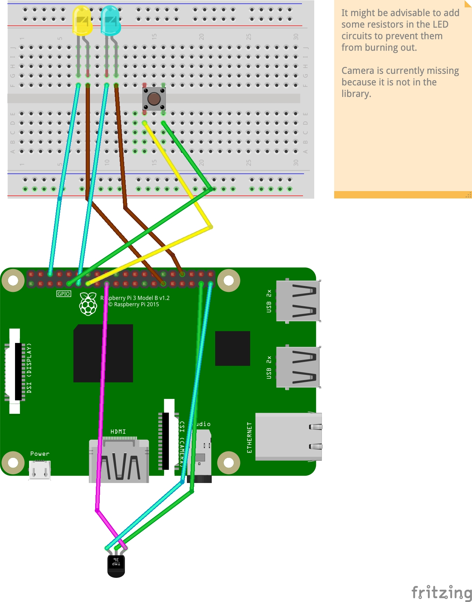

# birdwatcher

Just for some context: This is a small raspberry pie project for my kids.
Of course it would be more practical to use other hardware, that could run on batteries and would not consume this much power or space.

## basic functionallity

The birdwatcher is supposed to take a picture if it detects motion with the PIR senor. The picture is stored locally (might later be uploaded to the cloud or sent via telegram)

* press the button to start the birdwatcher
* blue LED indicates the birdwatcher is running.
* wait for movement
* yellow LED flashes while picture is taken
* press button again to stop birdwatcher script

## instructions

start launcher.py

    python3 launcher.py

you can also skip the launcher and start the birdwathcer directly

    python3 bird_watcher.py

## setup

## example fotos

